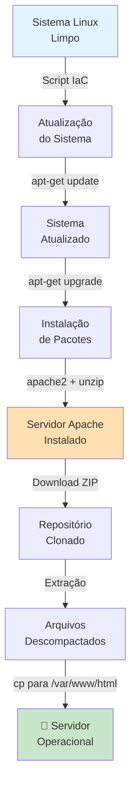
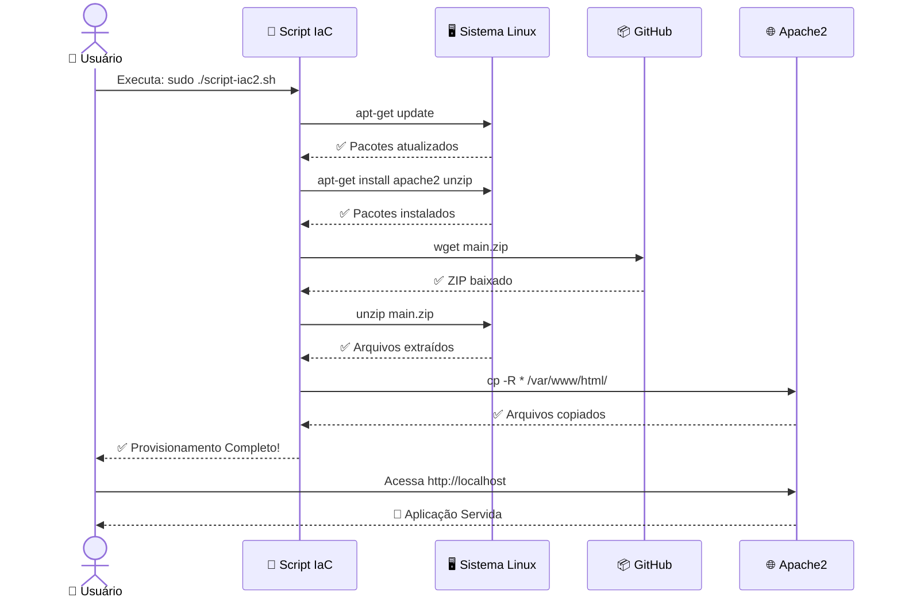

# 🚀 Infraestrutura como Código - Script de Provisionamento de Servidor Web (Apache)

   

Automatize o provisionamento completo de um servidor web Apache usando **Infraestrutura como Código (IaC)** com um script Bash simples e poderoso.

---

## 📋 Sobre o Projeto

Este projeto implementa o conceito de **Infraestrutura como Código**, permitindo provisionar automaticamente um servidor web Apache em ambientes Linux. Em vez de fazer configurações manuais, tudo é scriptado, garantindo:

- ✅ **Consistência**: Mesmo resultado toda vez que executa
- ✅ **Reprodutibilidade**: Fácil replicar em múltiplas máquinas
- ✅ **Documentação viva**: O script é a documentação da infraestrutura
- ✅ **Velocidade**: Provisionamento em minutos ao invés de horas

**Perfeito para portfólio?** Sim! Demonstra conhecimento em:
- Linux e administração de sistemas
- Automação e scripting
- DevOps e cultura de infraestrutura
- Conceitos práticos de Cloud

---

## 🏗️ Arquitetura da Solução



---

## 🚀 Quick Start

### Pré-requisitos
- ✅ Máquina Linux (Ubuntu/Debian recomendado)
- ✅ Acesso SSH ou terminal local
- ✅ Permissões de `sudo`
- ✅ Conexão com internet

### Executar o Script

```bash
# 1. Clone o repositório
git clone https://github.com/seu-usuario/seu-repositorio.git
cd seu-repositorio

# 2. Dê permissão de execução ao script
chmod +x script-iac2.sh

# 3. Execute o script com permissões de administrador
sudo ./script-iac2.sh
```

**Pronto!** Seu servidor Apache estará rodando em `http://localhost` 🎉

---

## ⚙️ Como Funciona (Detalhamento Técnico)

### O que o Script Faz - Passo a Passo

O `script-iac2.sh` executa uma sequência automática de comandos:

#### **1️⃣ Atualização do Sistema**
```bash
apt-get update      # Atualiza lista de pacotes
apt-get upgrade -y  # Instala atualizações disponíveis
```
- `update`: Sincroniza com repositórios remotos
- `upgrade -y`: Aplica atualizações (flag `-y` aceita automaticamente)
- **Por quê?** Garante segurança e compatibilidade

#### **2️⃣ Instalação de Dependências**
```bash
apt-get install apache2 -y   # Servidor web Apache
apt-get install unzip -y     # Ferramenta de descompactação
```
- **apache2**: O servidor HTTP que vai servir a aplicação
- **unzip**: Necessário para extrair o arquivo ZIP baixado
- Flag `-y`: Evita prompts interativas (essencial para automação)

#### **3️⃣ Download da Aplicação**
```bash
cd /tmp                                                          # Diretório temporário
wget https://github.com/denilsonbonatti/linux-site-dio/archive/refs/heads/main.zip
```
- `wget`: Faz download da URL
- Repositório original contém os arquivos da aplicação web
- Armazenado em `/tmp` (limpeza automática)

#### **4️⃣ Extração e Deploy**
```bash
unzip main.zip                    # Extrai o ZIP
cd linux-site-dio                # Entra na pasta extraída
cp -R * /var/www/html/           # Copia TUDO para raiz do Apache
```
- `/var/www/html/`: Diretório padrão de arquivos web do Apache
- `cp -R`: Copia recursivamente (incluindo subpastas)
- Apache agora serve esses arquivos automaticamente

---

## 📊 Fluxo Completo de Execução



---

## 🔧 Troubleshooting

### ❌ "Permission denied" ao executar o script?
```bash
chmod +x script-iac2.sh
```
Certifique-se que o arquivo tem permissão de execução.

### ❌ "Command not found: apache2"?
Verifique se o `apt-get update` foi executado antes de `apt-get install`. Pode ser necessário aguardar alguns segundos entre comandos em alguns sistemas.

### ❌ Porta 80 já está em uso?
```bash
sudo systemctl status apache2    # Verifica status
sudo systemctl restart apache2   # Reinicia o serviço
```

---

## 📚 Conceitos-Chave de IaC

| Conceito | Explicação | Benefício |
|----------|-----------|----------|
| **Idempotência** | Script pode ser executado múltiplas vezes com segurança | Evita erros por execuções repetidas |
| **Automação** | Sem intervenção manual | Reduz erros humanos e poupa tempo |
| **Versionamento** | Scripts no Git = histórico da infraestrutura | Rastreabilidade e rollback |
| **Documentação Viva** | Código é documentação | Sempre sincronizado com realidade |

---

## 🔗 Referências e Recursos

- 📖 [Documentação Apache2](https://httpd.apache.org/docs/)
- 📘 [Guia Linux - DIO](https://web.dio.me/track/formacao-linux-fundamentals)
- 🐧 [Comando apt-get - Man Pages](https://linux.die.net/man/8/apt-get)
- 💾 [Infraestrutura como Código - Wikipedia](https://pt.wikipedia.org/wiki/Infrastructure_as_Code)
- 🔗 [Repositório Original (Denilson Bonatti)](https://github.com/denilsonbonatti/linux-site-dio)

---

## 📄 Licença

[A definir]

---

**Criado como projeto de aprendizado para [Formação Linux Fundamentals - DIO](https://web.dio.me/track/formacao-linux-fundamentals)**

*Quer melhorar este README? Sugestões são bem-vindas!* 💡
